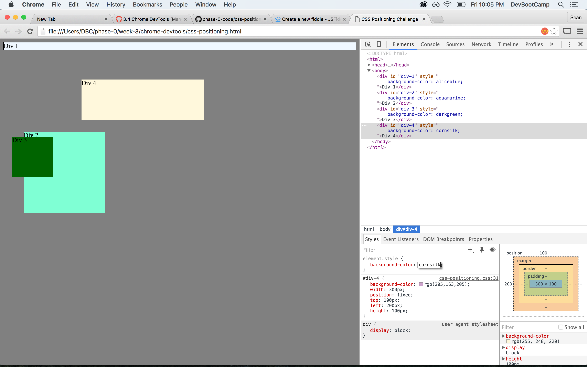

##How can you use Chrome's DevTools inspector to help you format or position elements?
As soon as you open up Chrome's DevTools you can look at and edit elements within the page. This can help you see live time what your changes are doing then you can apply them to the code you are working on.

##How can you resize elements on the DOM using CSS?
  You do this the exact same way to would using regular CSS, the only thing is you have to click on the element you want to resize. Width: _px; and Height: _px; are two ways to do this.

##What are the differences between absolute, fixed, static, and relative positioning? Which did you find easiest to use? Which was most difficult?
  * Static - Page default, this is how things are normally positioned.
  * absolute - You can use this to place the object right where you want it.
  * fixed - This stops an element from scrolling.
  * relative - This moves the object relative to its current position.

    to me absolute makes the most sense, though none of them were really more difficult than the other, they were all new and strange to me.

##What are the differences between margin, border, and padding?
  Margin is the furthest most edge outside of the border this area is transparent. The border is next, and this goes around padding. padding is the space right around the content.

##What was your impression of this challenge overall? (love, hate, and why?)
  This challenge was slightly difficult, but at the same time really fun and informational, I think it put a lot more of these things into perspective for me.
